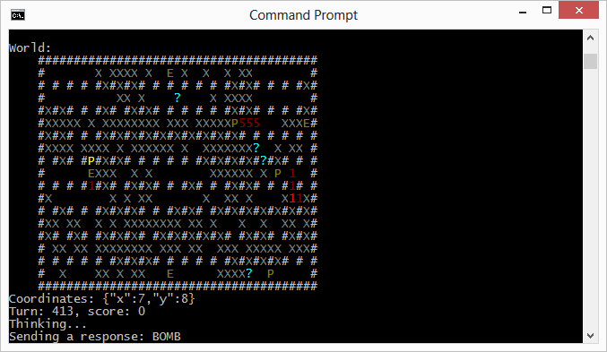

nodeschool
==========

Cybercom Finland will host a Nodeschool event for university students.
The event will be staged at autumn 2014 in Tampere, Finland.

This project is the source code base for the Nodeschool event.

## Description

Cybercom Finland will provide a simple Bomberman like open source turn-based 2D game framework as the basis for the event.
The framework is built with JavaScript on top of [Node.js](http://nodejs.org) platform,
it uses [Socket.IO](http://socket.io) for client <=> server (both node applications) communication and
[Phaser](http://phaser.io) for rendering the game graphics to HTML5 frontend.

The game server will take care of creating, updating and rendering the game world, including a few enemies and pickups.
The framework will provide also the basis for a client (player) implementation.
The challenge for the Nodeschool participants is to develop a piece of artificial intelligence to their players,
who will destroy other players and enemies and avoid getting killed themselves.

Graphics are not yet ready, but this kind of console output is available for both server and client processes:

Index of the items in the world map:

- # Non-destructible walls
- X Destructible walls
- P Player (bright one is the current player and the dim ones are the other players)
- E Enemy
- 5 Bomb (showing the countdown timer)
- ? Pickup

## Rules

The winner of the game is the player is the one who gets more points than other players.

Game is turn-based, so in one turn player can either:

 - Move UP
 - Move DOWN
 - Move LEFT
 - Move RIGHT
 - Leave bomb

If a player tries to move to direction which is not valid (open space), he will lose his turn as the move is not possible.

Enemies are only moving during their turns; they cannot leave bombs.

Bomb timers are also functioning turn-based.

Player can destroy other players, enemies or destructible walls by leaving bombs that explode after timer expires.
The players who leave bombs that destroy other objects will receive points from each destroyed object (but himself).

Player gets killed if a bomb explodes too near him or enemy touches him.
If the player gets killed, he loses some points and gets respawned with default properties after 5 turns at a random point.

If the player is disconnected during its turn, he loses its turn and cannot move.
While being disconnected other players and enemies can kill the player.
When the player is reconnected, he can continue playing from the point he was when disconnected (if still alive).

There are some pickups hidden under several destructible walls.
At least following pickups are available:

- Increase bomb power
- Randomize turn queue
- Add more destructible walls

Bomb power is incrementally added to the player's personal property,
thus gathering several bomb power pickups add incrementally more power to the bombs left by the player owning the pickups.
If the player gets killed, he will lose all the bomb power he possibly has gathered.

## Scoring

When player kills another player or enemy, he will get 50 points.

When player destroys a destructible wall, he will get 10 points.

When player gets killed, he will lose 100 points.

## Installation

Install [Node.js](http://nodejs.org) platform.

Fetch the source code from [GitHub](https://github.com/cybercom-finland/nodeschool.git).

Install dependency node modules: `npm install` at project root folder.

## Running the application

Run the application in server mode: `node app.js`.
- config.json is used as a default configuration file, running in server mode.

Run the application in server mode: `node app.js configClient.json`.
- configClient.json contains and example of client configuration.

By default the application is run at localhost port 3000.
Thus the frontend can be opened by default at http://localhost:3000 url.

## Notes

- Currently no graphics are included.
